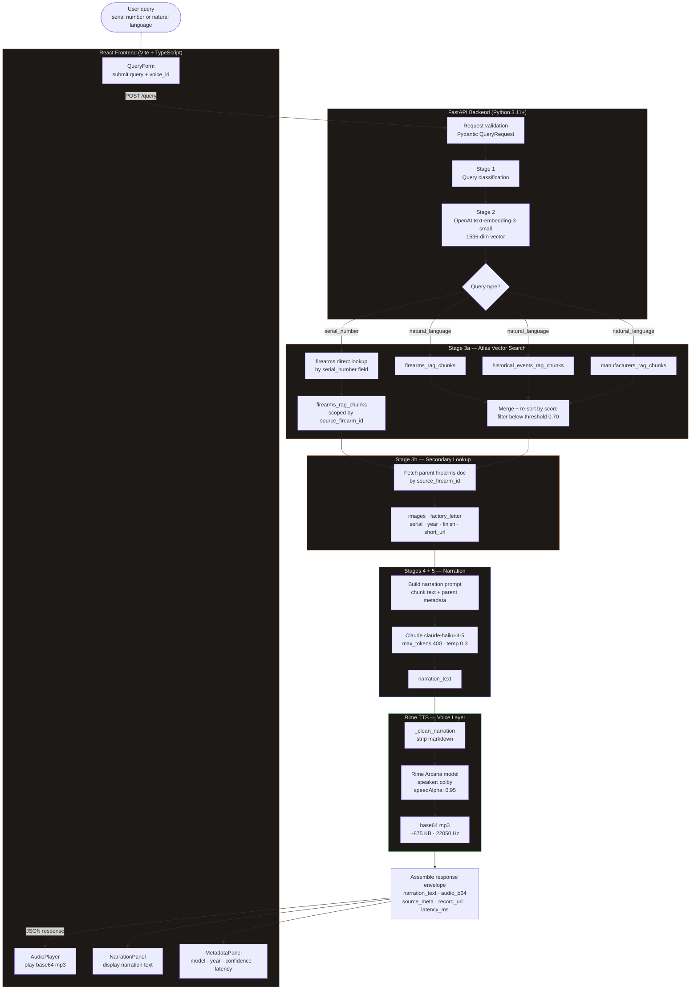
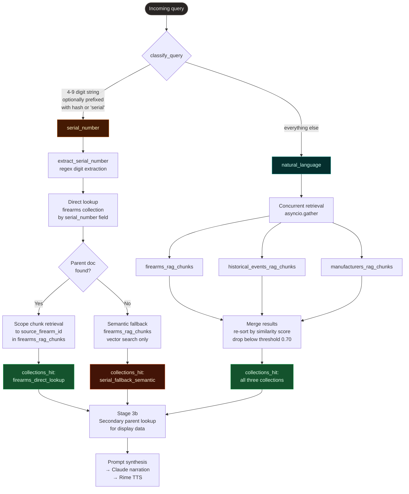
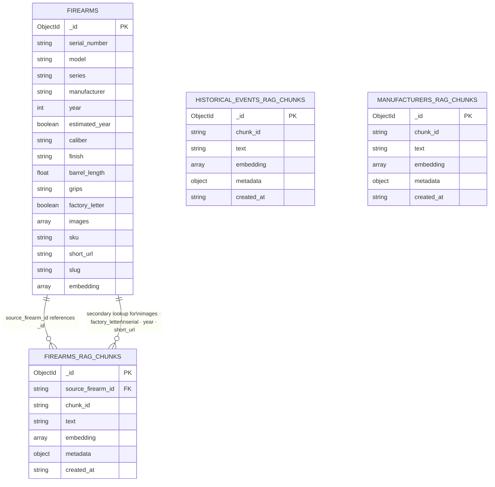
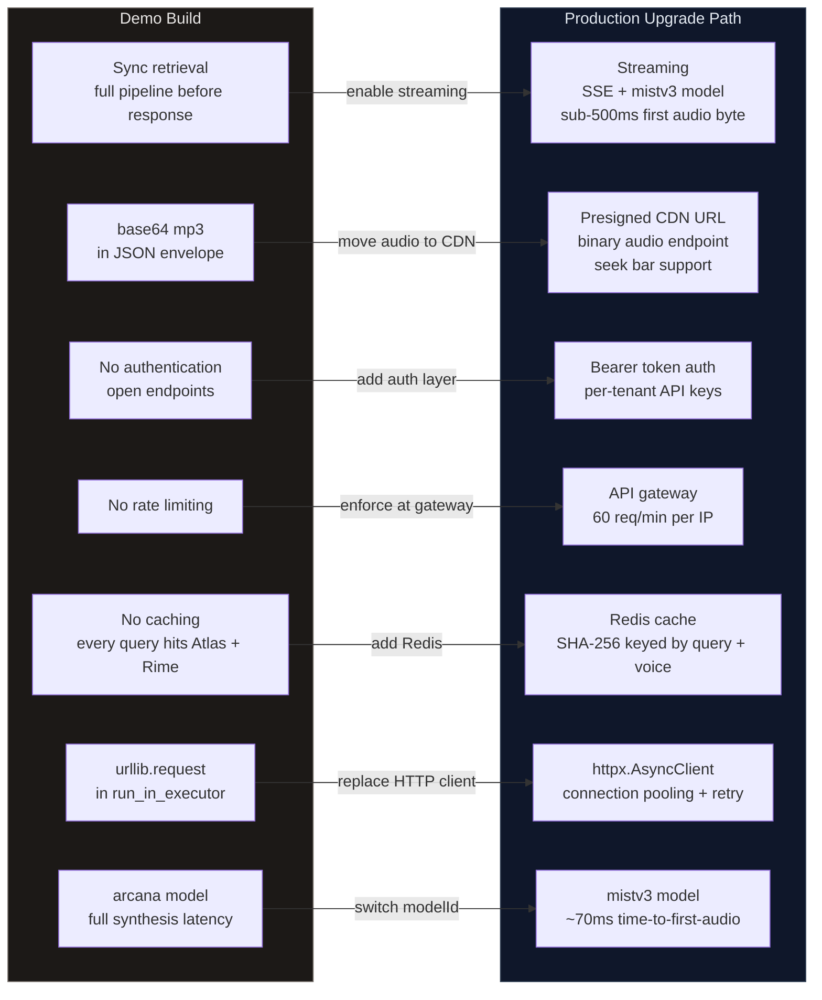

# Architecture Diagrams

Visual reference for the Abiqua Collection Voice RAG system architecture.
All diagrams render natively in GitHub markdown.

---

## 1. Full Request Flow

End-to-end pipeline from user query to synthesized audio response.

---

## 2. Query Routing Logic

How the query classification decision determines retrieval behavior.

---

## 3. Collection Data Model

Relationships between the four MongoDB collections and the role each plays.

---

## 4. Demo vs. Production Decision Map

Where this build makes deliberate simplifications and what the production
upgrade path looks like for each.

