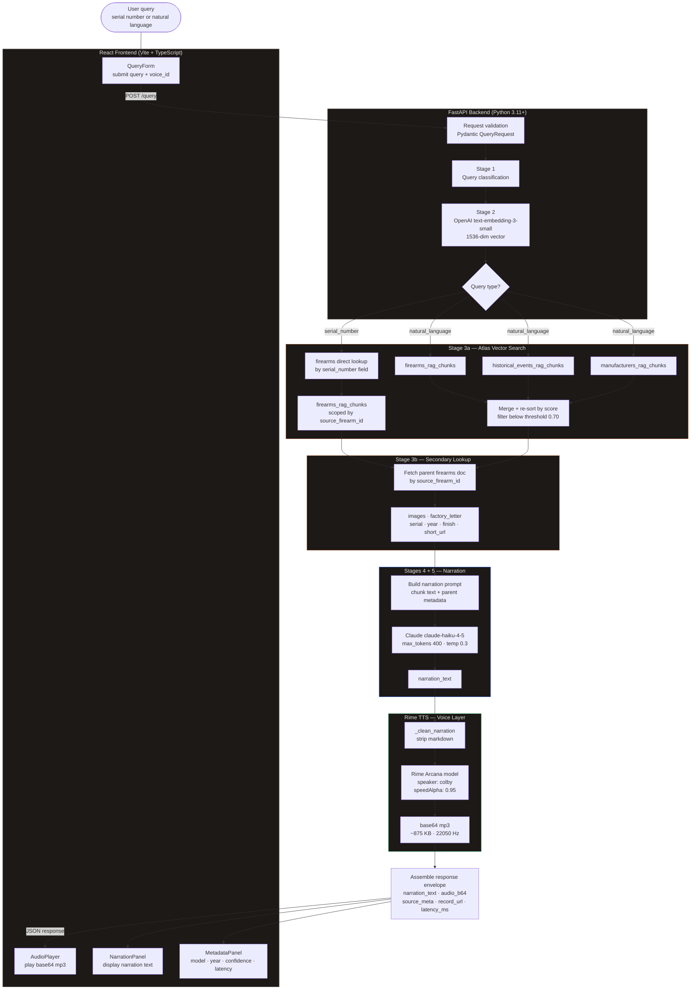

# Abiqua Collection — Voice RAG System

A voice-first provenance research tool built on a real-world dataset: the
[Abiqua Collection](https://theabiquacollection.com), a digital museum
documenting the history and provenance of Smith & Wesson revolvers.

Ask a question in natural language or enter a serial number. The system
retrieves relevant provenance records from MongoDB Atlas, synthesizes a
historically grounded narration using Claude, and delivers it as synthesized
speech via Rime TTS — alongside source metadata and archival images.

> **Demo video:** [Watch the demo](https://www.youtube.com/watch?v=YOUR_VIDEO_ID)
> *(Add link once recorded)*

---

## What this demonstrates

- **Voice AI + RAG architecture** — a complete pipeline from query to
synthesized audio, built on real collection data
- **MongoDB Atlas Vector Search** — semantic retrieval against an existing
production database with zero infrastructure changes
- **LlamaIndex orchestration** — query classification, embedding, retrieval,
and prompt synthesis in a clean five-stage pipeline
- **Rime TTS integration** — narration synthesis using the Arcana model with
configurable regional endpoint and voice
- **Demo vs. production callouts** — every architectural shortcut is
documented with its production upgrade path

This is not a toy dataset. The firearms collection contains real provenance
records including factory letters, shipping records, and archival notes
spanning the 1880s through the mid-20th century.

---

## Architecture




Full architecture decisions and component contracts are in `/docs/specs/`.

See [ARCHITECTURE.md](ARCHITECTURE.md) for detailed Mermaid diagrams
including query routing logic, collection data model, and demo vs.
production decision map.
---

## Stack


| Layer              | Technology                                 |
| ------------------ | ------------------------------------------ |
| Frontend           | React 18, TypeScript, Vite, Tailwind CSS   |
| Backend            | Python 3.11+, FastAPI                      |
| Package management | uv                                         |
| RAG orchestration  | LlamaIndex                                 |
| Vector database    | MongoDB Atlas Vector Search                |
| Embeddings         | OpenAI text-embedding-3-small              |
| LLM                | Anthropic Claude (claude-haiku-4-5)        |
| TTS                | Rime (default: Mist model, configurable)   |
| Collection data    | MongoDB Atlas (proprietary — not included) |


---

## Prerequisites

- Python 3.11 or later
- [uv](https://docs.astral.sh/uv/getting-started/installation/) (recommended) or pip
- Node.js 18 or later
- MongoDB Atlas cluster with Vector Search already configured
- API keys: OpenAI, Anthropic, Rime

Install uv if you don't have it:

```bash
curl -LsSf https://astral.sh/uv/install.sh | sh   # macOS / Linux
# or
winget install astral-sh.uv                        # Windows
```

---

## Setup

### 1. Clone the repository

```bash
git clone https://github.com/kenwalger/abiqua-voice-rag.git
cd abiqua-voice-rag
```

### 2. Backend

**With uv (recommended):**

```bash
cd backend
uv sync
```

`uv sync` creates the virtual environment and installs all dependencies from
`pyproject.toml` in one step. No manual activation needed — prefix subsequent
commands with `uv run`.

Using pip instead

```bash
cd backend
python -m venv .venv
source .venv/bin/activate        # Windows: .venv\Scripts\activate
pip install -r requirements.txt
```


Copy the environment template and fill in your values:

```bash
cp .env.example .env
```

See `.env.example` for all required variables. At minimum you need:

- `MONGODB_URI` — your Atlas connection string
- `MONGODB_DB_NAME` — database containing the firearms collection
- `MONGODB_VECTOR_INDEX` — name of your existing Vector Search index
- `OPENAI_API_KEY` — for embedding
- `ANTHROPIC_API_KEY` — for narration synthesis
- `RIME_API_KEY` — for TTS

### 3. Prepare your Atlas collection

If your collection documents don't yet have a `search_text` field, run the
migration script to add it. This does not modify your existing embedding
vectors — it only adds the plain-text retrieval field LlamaIndex uses for
prompt context.

```bash
# With uv
uv run python scripts/migrate_search_text.py

# With pip (venv activated)
python scripts/migrate_search_text.py
```

> **Already indexed?** If your Atlas Vector Search index is already configured
> and your documents already have embedding vectors, you only need to run the
> migration script above. No re-embedding required. See
> [Verifying your Atlas index](#verifying-your-atlas-vector-search-index) below.

> **Note:** You need your own MongoDB Atlas collection with firearms data.
> The Abiqua Collection dataset is proprietary and not included in this
> repository. The system architecture and code are fully transferable to any
> similarly structured collection. See `/docs/examples/sample_document.json`
> for the expected document schema.

### 4. Start the backend

```bash
# With uv
uv run uvicorn app.main:app --reload --port 8000

# With pip (venv activated)
uvicorn app.main:app --reload --port 8000
```

> If you see inconsistent behavior or no logs, ensure only one process is
> listening on port 8000 before starting uvicorn.

Verify it's running:

```bash
curl http://localhost:8000/health
# {"status":"ok","version":"1.0.0"}
```

Check all dependencies are reachable:

```bash
curl http://localhost:8000/ready
# {"status":"ready","atlas":"ok","rime":"ok"}
```

### 5. Frontend

```bash
cd frontend
npm install
cp .env.example .env.local
```

The default `.env.local` points to `http://localhost:8000` — no changes
needed for local development.

```bash
npm run dev
```

Open [http://localhost:5173](http://localhost:5173).

---

## Debugging and diagnostics

### Backend pipeline logs

Enable detailed backend timing logs for `/voices`, retrieval, narration, and
TTS:

```bash
PIPELINE_DEBUG=true
LOG_LEVEL=INFO
```

Optional local error detail in JSON responses:

```bash
EXPOSE_INTERNAL_ERRORS=true
```

Restart backend after changing env values.

### Frontend API timing logs

Enable axios request/response timing logs in the browser console:

```bash
VITE_PIPELINE_DEBUG=true
```

Restart Vite dev server after changing `.env.local`.

### Port 8000 contention (Windows)

If requests time out and logs do not appear, you may have multiple listeners on
`127.0.0.1:8000`. Clear the port and run one backend process:

```powershell
Get-NetTCPConnection -LocalPort 8000 -State Listen | Select-Object -Expand OwningProcess -Unique | ForEach-Object { Stop-Process -Id $_ -Force }
cd c:\Users\kenal\abiqua-voice-rag\backend
uv run uvicorn app.main:app --host 127.0.0.1 --port 8000 --reload --log-level debug --access-log
```

---

## Usage

**Serial number query:**

```plaintext
143960
```

Returns the exact matching firearm record with synthesized narration,
source metadata, and image references. Serial queries use a deterministic
direct lookup path — not semantic search — guaranteeing exact-record
precision.

**Natural language query:**

```plaintext
tell me about the 1905 New Departure shipped to China
```

Queries all three `rag_chunks` collections concurrently and merges results
before narration synthesis.

**Example response (serial query):**

```json
{
  "narration_text": "This .32 New Departure, serial number 143960, was
    manufactured in 1905 and retains its original nickel finish...",
  "image_count": 4,
  "source_meta": {
    "model": ".32 New Departure",
    "serial_range": "143960",
    "year_start": 1905,
    "confidence": 1.0
  },
  "record_url": "https://theabiquacollection.com/f/fbGhMSuH",
  "collections_hit": ["firearms_direct_lookup"],
  "latency_ms": 3862
}
```

---

## Verifying your Atlas Vector Search index

Before the first run, confirm your index dimension matches the embedding model:

```javascript
// In mongosh
db.firearms.getSearchIndexes()
// Look for numDimensions: 1536
```

If your index was auto-configured or set up previously, it is almost certainly
1536 dimensions — consistent with `text-embedding-3-small` and `ada-002`. If
the dimension differs, update `LLAMAINDEX_EMBED_MODEL` in `.env` to match the
model that generated your existing vectors.

---

## Demo query

Serial number `143960` exercises the full pipeline end to end:

- **Record:** .32 New Departure 2nd Model, 1905, nickel finish
- **Retrieval path:** `firearms_direct_lookup` (deterministic serial match)
- **Audio:** ~875 KB synthesized mp3, Rime Mist model, voice: abbie
- **Images:** 4 archival images
- **Pipeline latency:** ~3.8s (sync retrieval, pre-streaming)

Natural language queries hit all three rag_chunks collections
concurrently and merge results before narration synthesis.
---

## Regional endpoint

The Rime integration defaults to `https://users-west.rime.ai`. To use a
different regional endpoint, set `RIME_BASE_URL` in your `.env`:

```bash
RIME_BASE_URL=https://users.rime.ai
```

---

## Production upgrade paths

This is a demo build. Every shortcut has a documented upgrade path:


| Demo decision        | Production path                            |
| -------------------- | ------------------------------------------ |
| No authentication    | Bearer token auth, per-tenant API keys     |
| Sync retrieval       | Streaming with mistv3 + SSE transport      |
| Base64 audio in JSON | Presigned CDN URL, binary audio endpoint   |
| No rate limiting     | API gateway enforcement, 60 req/min per IP |
| No caching           | Redis, SHA-256 keyed by query + voice_id   |
| urllib HTTP client   | httpx.AsyncClient with retry and backoff   |
| Single collection    | Multi-collection LlamaIndex retrieval      |


Full rationale for each decision is in the spec documents under `/docs/specs/`.

---

## Project structure

```
abiqua-voice-rag/
├── backend/
│   ├── app/
│   │   ├── main.py            # FastAPI app and route definitions
│   │   ├── orchestrator.py    # LlamaIndex pipeline
│   │   ├── rime.py            # Rime TTS integration
│   │   └── settings.py        # Environment variable loading
│   ├── scripts/
│   │   └── migrate_search_text.py
│   ├── pyproject.toml         # uv / pip dependencies
│   ├── requirements.txt       # pip-compatible lockfile (generated)
│   └── .env.example
├── frontend/
│   ├── src/
│   │   ├── App.tsx
│   │   ├── api/client.ts
│   │   ├── types/api.ts
│   │   └── components/
│   ├── package.json
│   └── .env.example
├── docs/
│   ├── specs/
│   │   ├── 01-fastapi-routes.md
│   │   ├── 02-llamaindex-orchestrator.md
│   │   ├── 03-mongodb-atlas.md
│   │   ├── 04-rime-tts.md
│   │   └── 05-react-frontend.md
│   └── examples/
│       └── sample_document.json   # Sanitized schema reference
├── LICENSE
├── CONTRIBUTING.md
├── CHANGELOG.md
└── SECURITY.md
```

---

## Data note

The Abiqua Collection dataset — firearms records, provenance notes, historical
research, images, and all associated collection data — is proprietary and is
not included in this repository. The code is fully transferable to any
similarly structured MongoDB collection. See `/docs/examples/sample_document.json`
for the expected document schema with field descriptions.

---

## Related content

This project is documented as part of a technical blog series on AI, MCP, and
agentic systems. Posts covering the architecture, build decisions, and
production upgrade paths are published on
[LinkedIn](https://www.linkedin.com/in/kenwalger) and
[dev.to](https://dev.to/kenwalger).

---

## License

MIT — see [LICENSE](LICENSE) for details.

Code only. Collection data is not licensed for use or reproduction.